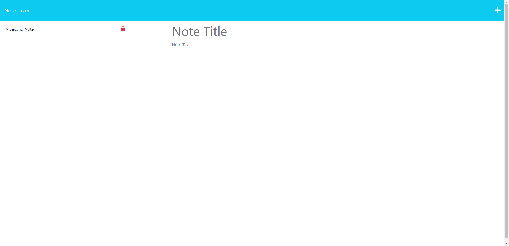

# Note_Taker
 ## Table of Contents
  - [Description](#description)
  - [Installation](#installation)
  - [Usage](#usage)
  - [License](#license)
  - [Contributing](#contributing)
  - [Tests](#tests)
  - [Questions](#questions)

  ## Description
  When creating this project, I set out to create a note taking website, in order to allow the user to keep track of any tasks they need to get done. By completing this assignment, I learned how to use Heroku.

  ## Installation
  Clone this repository into your local machine, then do the following commands:

  ```npm i```

  ```npm start```
  
  ## Usage
  To use this project, go to the following Heroku URL: https://desolate-shelf-00322-f69b50c2a7eb.herokuapp.com/

 When you open the site, you should see the following homepage:

 

From there, you can type in a title and the information for any note you would like the keep. That process should look like this:

 

 After that, you will want to click on the save button on the top right hand of the screen. You will then find the note added to a list in the left column, and you can click on the title to see its full contents. Here is what a saved note will look like:

 

 After you have completed the task, or simply wish to delete the note, all you need to do is click on the trash can icon next to the title to remove it. For this example, here is the page after the original note has been removed, and a second note has been added:



 ## License
 
  This project is licensed under the terms of the **[MIT License](https://opensource.org/licenses/MIT)**
  
  ## Contribution
  
Rutgers Fullstack Flex Coding Bootcamp provided the starter code

  ## Tests
  
  N/A

  ## Questions
  If you have any questions or suggestions about this project, please feel free to contact me:
- GitHub: [@jeslocascio](http://github.com/jeslocascio)
- Email: locascioje@gmail.com
